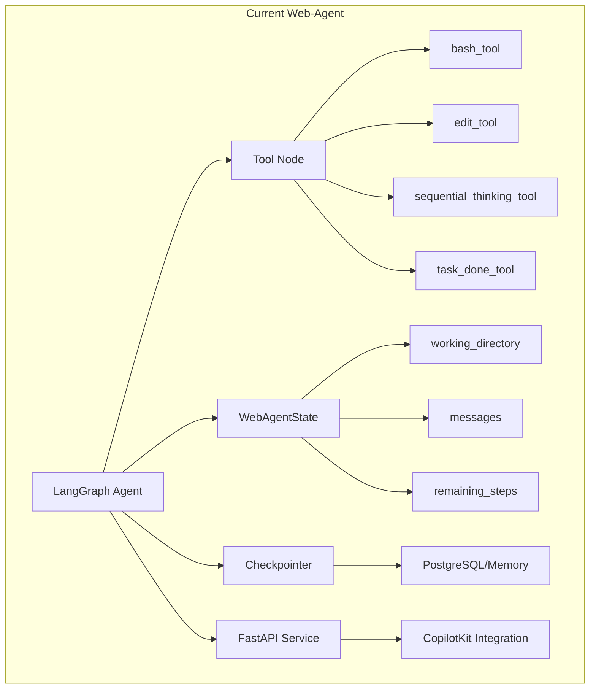
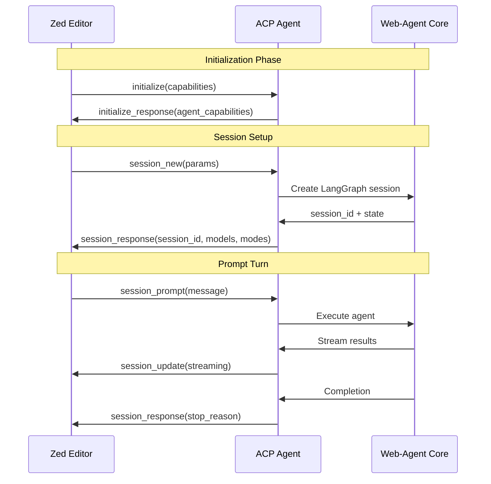
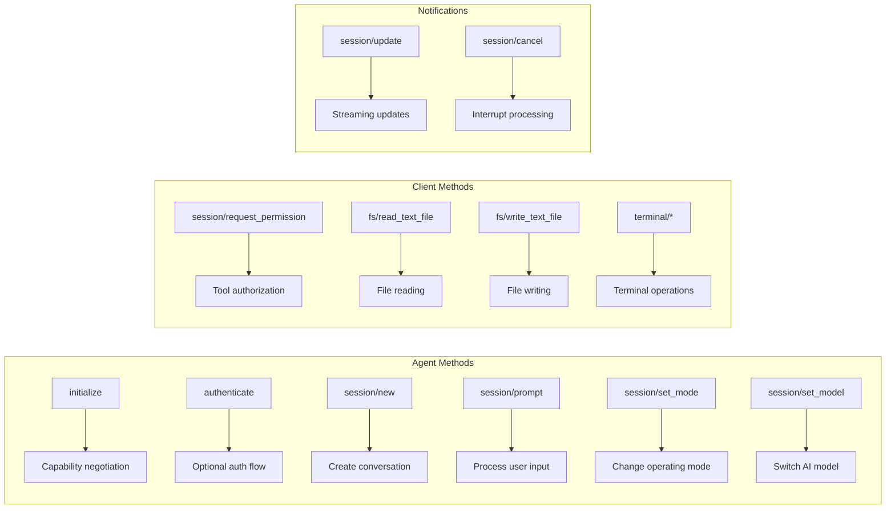
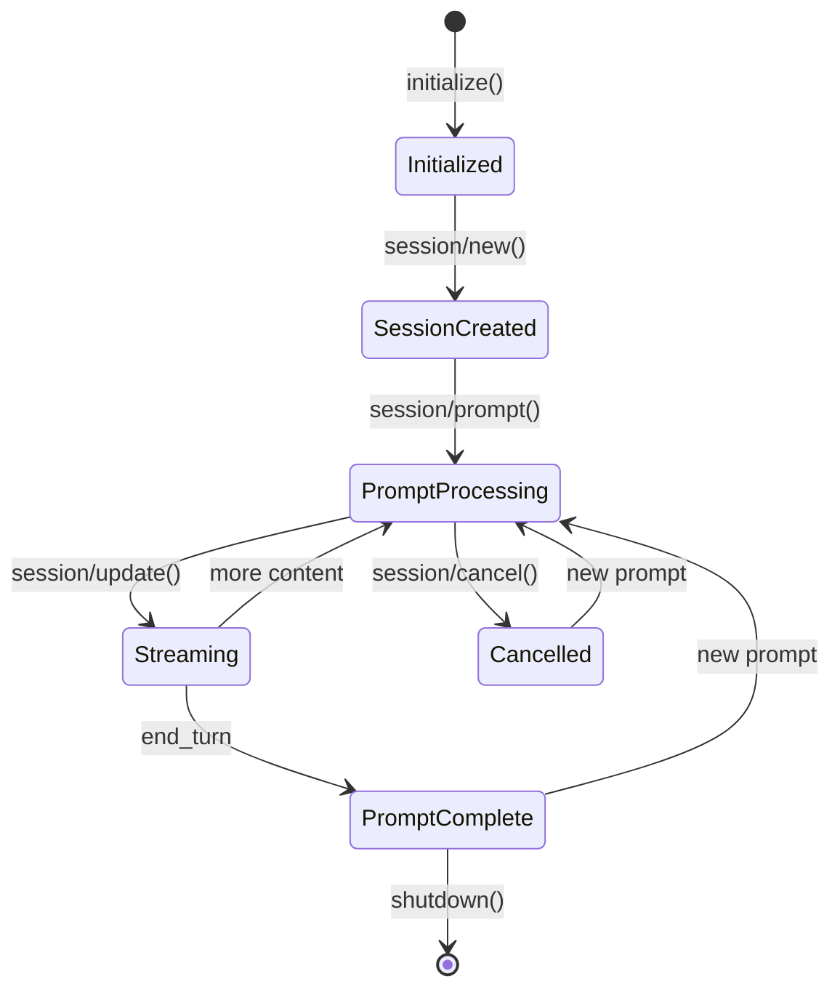
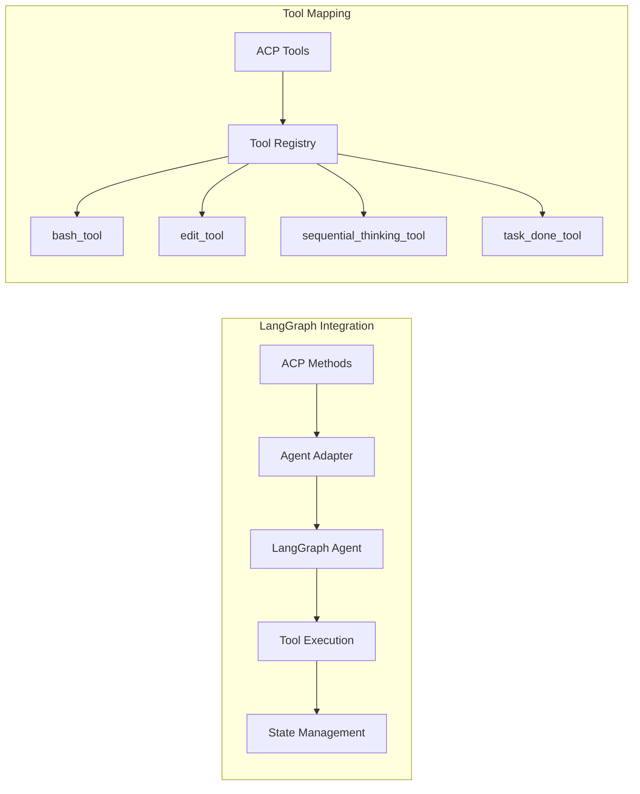
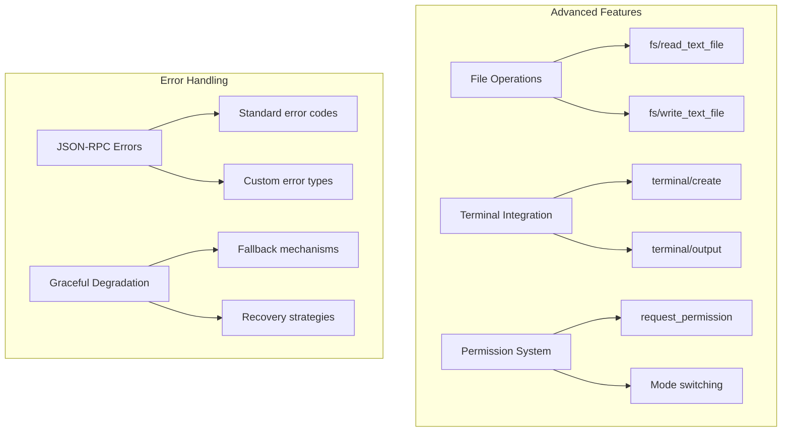
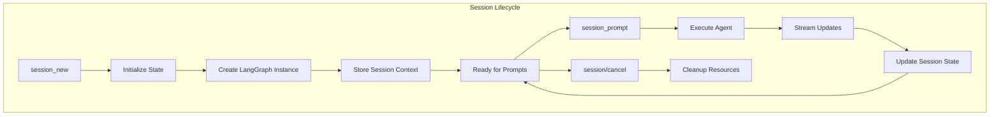
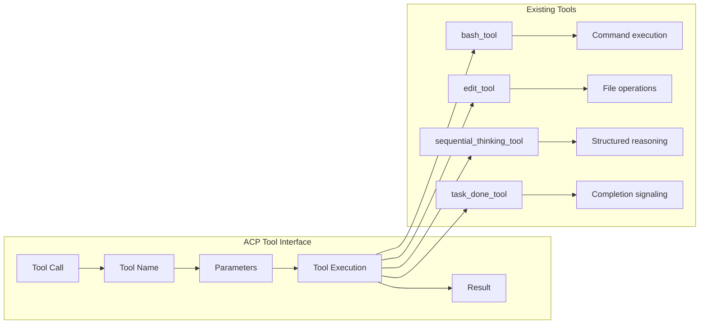
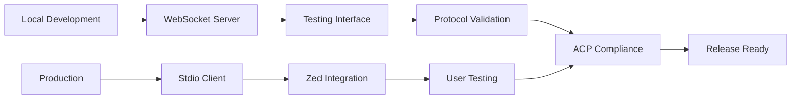

# ACP Integration Plan for Web-Agent

## Executive Summary

This plan outlines the integration of the Agent Client Protocol (ACP) with our existing web-agent system. ACP is essentially the "LSP for AI coding agents" - a standardized protocol that enables interoperability between different AI agents and code editors, particularly Zed.

**Timeline Estimate:** 4-7 days for full integration
**Key Insight:** We're adapting our existing LangGraph agent to speak ACP, not rebuilding from scratch

## Current Architecture Analysis

### Existing Web-Agent System



### ACP Protocol Structure



## ACP Protocol Deep Dive

### Core Methods Required



### Message Flow Architecture



## Integration Strategy

### Phase 1: Core ACP Implementation (Days 1-2)

```mermaid
graph TB
    subgraph "Day 1: Protocol Foundation"
        A1[JSON-RPC 2.0 Base] --> A2[ACP Method Router]
        A2 --> A3[Session Manager]
        A3 --> A4[Message Serializer]
    end
    
    subgraph "Day 2: Core Methods"
        B1[initialize()] --> B2[session_new()]
        B2 --> B3[session_prompt()]
        B3 --> B4[session_update()]
    end
    
    A4 --> B1
```

**Tasks:**
1. Implement proper JSON-RPC 2.0 with NDJSON streaming
2. Create ACP method router and dispatcher
3. Build session management system
4. Implement core ACP methods from spec

### Phase 2: Agent Integration (Days 3-4)



**Tasks:**
1. Create adapter between ACP and LangGraph
2. Map existing tools to ACP tool format
3. Handle streaming updates properly
4. Maintain working directory context

### Phase 3: Advanced Features (Days 5-7)



## Technical Implementation Details

### ACP Server Architecture

```python
# Core ACP Server Structure
class ACPServer:
    def __init__(self):
        self.sessions = {}  # Session management
        self.agent = None   # LangGraph agent
        self.capabilities = {
            "promptCapabilities": {
                "image": False,
                "embeddedContext": True
            },
            "fs": {
                "readTextFile": True,
                "writeTextFile": True
            },
            "terminal": True
        }
    
    async def initialize(self, request):
        # Capability negotiation
        pass
    
    async def session_new(self, request):
        # Create new session with LangGraph
        pass
    
    async def session_prompt(self, request):
        # Process user input with streaming
        pass
```

### Session Management



### Tool Integration Strategy



## File Structure Plan

```
web-agent/agent-py/src/web_agent/ACP/
├── __init__.py              # Package exports
├── __main__.py              # Module entry point
├── server.py                # ACP server implementation
├── client.py                # Stdio client for Zed
├── config.json              # ACP configuration
├── protocol/
│   ├── __init__.py
│   ├── methods.py           # ACP method implementations
│   ├── types.py             # ACP type definitions
│   ├── sessions.py          # Session management
│   └── streaming.py         # Streaming utilities
├── adapters/
│   ├── __init__.py
│   ├── langgraph_adapter.py # LangGraph integration
│   └── tool_adapter.py      # Tool mapping
└── utils/
    ├── __init__.py
    ├── json_rpc.py          # JSON-RPC utilities
    └── ndjson.py            # NDJSON streaming
```

## Configuration and Deployment

### Zed Configuration

```json
{
  "agents": {
    "web-agent": {
      "command": ["python", "-m", "web_agent.ACP"],
      "args": ["--transport", "stdio"],
      "transport": "stdio",
      "capabilities": {
        "fs": {
          "readTextFile": true,
          "writeTextFile": true
        },
        "terminal": true
      }
    }
  }
}
```

### Development Workflow



## Risk Assessment and Mitigation

### Technical Risks

| Risk | Impact | Probability | Mitigation |
|------|--------|-------------|------------|
| Streaming complexity | High | Medium | Use proven NDJSON patterns |
| Session state management | High | Low | Simple in-memory with persistence |
| Tool compatibility | Medium | Low | Direct mapping of existing tools |
| Performance overhead | Medium | Low | Efficient async implementation |

### Integration Risks

| Risk | Impact | Probability | Mitigation |
|------|--------|-------------|------------|
| Zed compatibility issues | High | Medium | Follow reference implementation |
| Protocol version mismatch | Medium | Low | Version negotiation in initialize |
| Breaking changes in ACP | Medium | Low | Monitor spec updates |

## Success Criteria

### Functional Requirements
- [ ] All core ACP methods implemented
- [ ] Streaming updates working correctly
- [ ] Session management robust
- [ ] Tool integration complete
- [ ] Error handling comprehensive

### Integration Requirements
- [ ] Zed can connect and initialize
- [ ] File operations work through Zed
- [ ] Terminal commands execute properly
- [ ] Sequential thinking preserved
- [ ] Task completion signaling works

### Performance Requirements
- [ ] Response time < 2 seconds for simple operations
- [ ] Streaming updates < 100ms latency
- [ ] Memory usage stable during long sessions
- [ ] Graceful handling of large files

## Next Steps

1. **Immediate (Today)**: Set up basic ACP server structure
2. **Day 1-2**: Implement core protocol methods
3. **Day 3-4**: Integrate with existing LangGraph agent
4. **Day 5-6**: Add advanced features and testing
5. **Day 7**: Polish, documentation, and deployment prep

## Conclusion

This integration is straightforward because we're adapting our existing, well-tested agent to speak a new protocol. The key insight is that ACP is just a messaging layer - our core agent logic remains unchanged. The reference implementation from Claude Code provides a solid foundation to follow, ensuring compatibility and reducing implementation risk.

The 4-7 day timeline is realistic because we're leveraging existing infrastructure and following established patterns. The main work is protocol adaptation, not agent development.